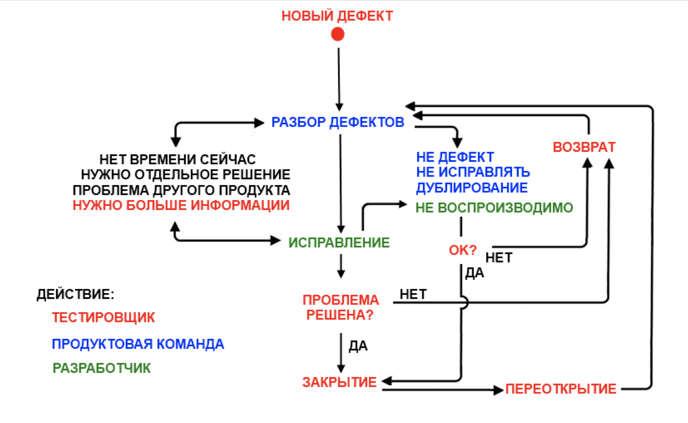

# ST-4 Модульное тестирование в .NET Core с использованием MSTest (C#) и библиотеки Stateless


Срок выполнения задания:

**по 12.04.2025** 

Данная работа демонстрирует модульное тестирование с помощью фреймворка MSTest на платформе .NET версии 9.x
Для выполнения работы необходимо добавить ссылку на пакет **Stateless** .NET, например так:

```
dotnet add package Stateless --version 5.13.0
```

## Задание №1

В рамках существующего решения (solution) **ST-4** добавить проект **BugPro** в виде консольного приложения и поместить в файл 
**BugPro/Program.cs** код класса **Bug** для описания WorkFlow работы с багом.

В качестве примера рабочего процесса предлагается следующий:



Далее, построить проект и убедиться, что консольное приложение запускается без ошибок и выводит на экран некоторую информацию.

## Задание №2

Добавить в решение еще один проект **BugTests**, указав тип проекта - **MSTest**. В файл **BugTests/UnitTest1.cs** поместить несколько тестовых методов, тестирующих класс-автомат, описанный в **BugPro/Program.cs**. Количество тестов - не менее 20 .

Для реализации бОльшего числа тестов, рекомендуется расширить класс **Bug**, добавив новые состояния и новые функции переходов. Обязательно должны присутствовать тесты, отлавливающие выбрасываемые **Stateless** исключения! 

## Примечание

После создания пул-запроса убедиться, что тесты корректно запускаются. Для этого нужно зайти в журнал GH Actions и убедиться, что все тесты запущены и успешно выполнены.
